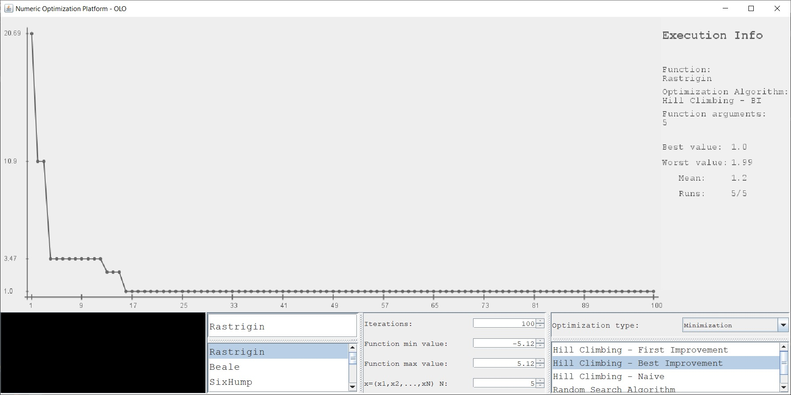

# Numerical-Optimization-Platform
A platform I wrote for an optional course from University - Genetic Algorithms

### Motivation

For this course I'll be supposed to implement different types of heuristic algorithms, and to run them on different functions. Since I created this platform, everything will be held in one place.
While writing this app, I encountered many application design problems (everything has to be abstractized in order to add new functions/algorithms easily), and solving them taught me a lot of new things.

### Functionalities:

* Select optimization algorithm
* Select function
* Select function arguments intervals
* Custom function parser
* Graph which displays how the best value has changed over iterations